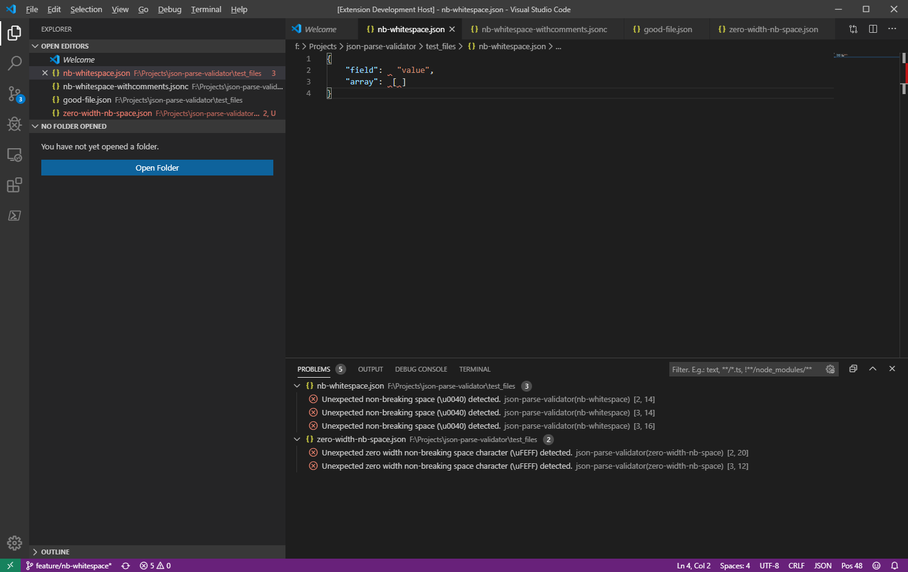
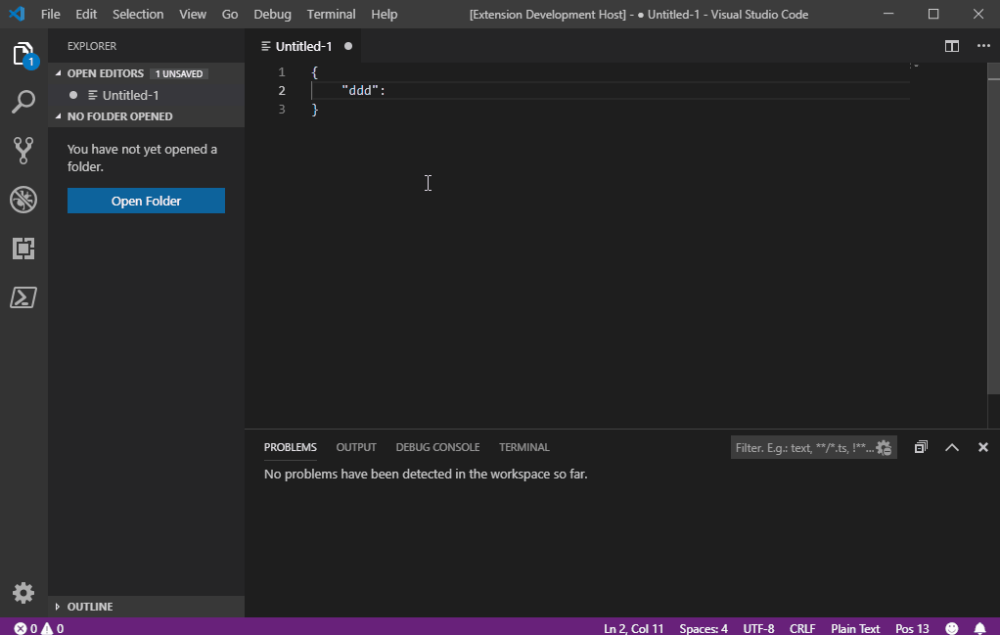

# json-parse-validator README

The "json-parse-validator" extension is meant to be used as the supplement to the in-built JSON language support in VS Code. It has been built to cover situations where in-built JSON linter reports a JSON document to be valid, but that same document is rejected by the `JSON.parse()` method. 

The extension will find and highlight invalid characters within a JSON document and provide actions to either:

* Replace with normal whitespace character (`\u0020`);
* Remove invalid character from the document.

> Note: in some cases, running the built-in Format Document command can also remove the invalid characters.

## Features

Validation errors appear within the standard PROBLEMS window:

Run `JSON.parse()` on your document on demand:

## Extension Settings

This extension has no settings in v1.1.1.

## Known Issues

- None

## Release Notes

### 1.1.2

- Fixed logo

### 1.1.1

- Upgrade NPM package references to fix packages with known security vulnerabilities.

### 1.1.0

- Added support for detecting various whitespace characters that result in a `SyntaxException` when processed by `JSON.parse()`.
- Each detected invalid character is now returned as a separate problem with the document.
- Added quickfix actions to replace invalid characters with normal whitespace (`\u020`) or remove from document.

### 1.0.0

Initial release of the extension:
 - Automatically parses document when in JSON language mode, and displays error in PROBLEMS window.
 - 'Parse with JSON.parse()' command to parse any open document on demand.

## Why did this extension get created?

I've personally found at times that VS Code shows no syntax errors or validation issues for the JSON document that I am working on, but when the JSON document is used in the target application, it cannot be read. This is often caused by bad character encoding of whitespace characters introduced by cut/paste from outside applications, that are not picked up by the in-built validator. 

Most of the time, it's a call to `JSON.parse()` which results in the JSON document being rejected as invalid JSON. Such an example is the [Azure Resource Group Deployment task](https://docs.microsoft.com/en-us/azure/devops/pipelines/tasks/deploy/azure-resource-group-deployment?view=azure-devops) in Azure Devops, which presently uses the `JSON.parse()` function to validate the provided ARM template before attempting to deploy.

Therefore, this extension was built in order to detect `JSON.parse()` issues as the document is being written.
